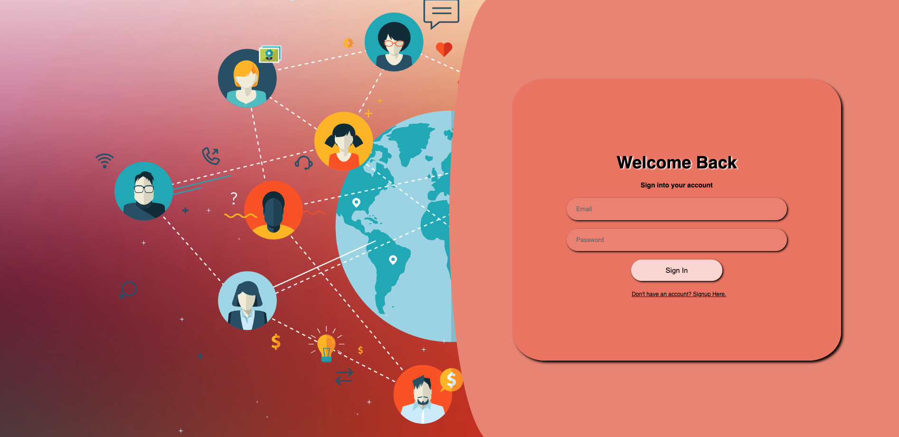
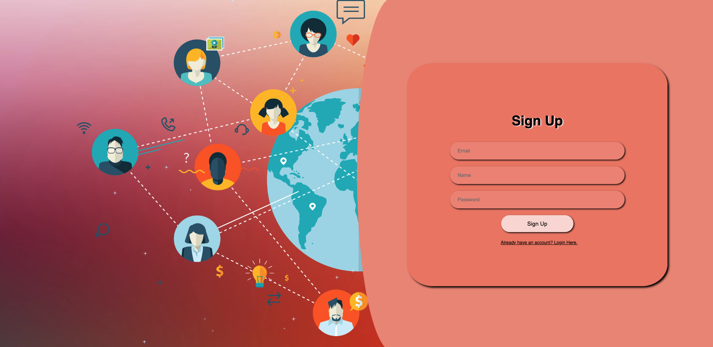
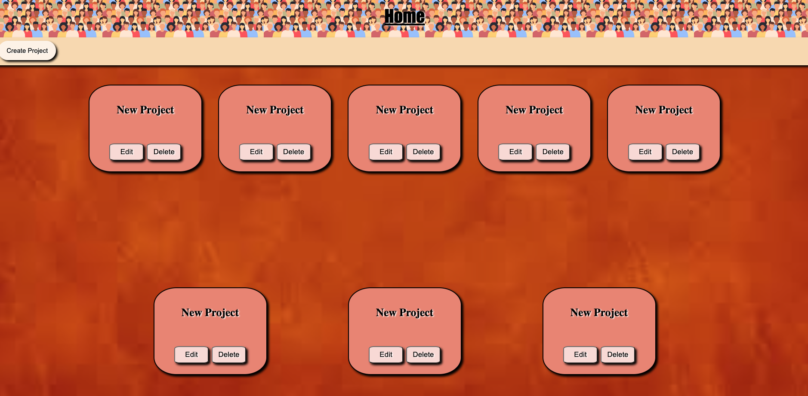
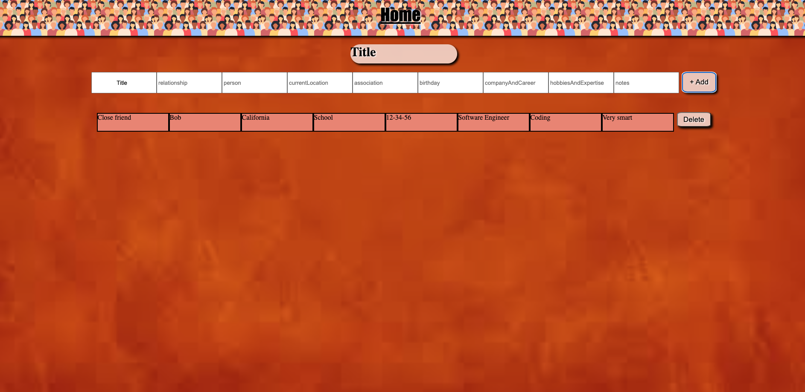

# Relationship Manager
## Date: 02/09/2023
### By: Hyun Bin Yim
#### [LinkedIn](https://www.linkedin.com/in/hyunbinyim/) | [Github](https://github.com/hby77) | [Trello](https://trello.com/b/OdPMNiek/project-2) | [Lucid](https://lucid.app/lucidchart/9c24a6a8-3879-4342-9466-0a8e11c6574a/edit?page=0_0&invitationId=inv_e85ceed0-7e1c-4313-98b3-7075aa2356c4#)
***
### ***Description***
#### This website is a relationship maanger. The purpose of this website is to help people organize and structure their relationships with other people. There are times when it is difficult to contact and maintain high levels of relationships simply due to the lack of structure and organization. This project will help make that a convenience and give the provided structure that is needed.
***
### ***Technologies Used***
* React
* Css
* Javascript
* Node.Js
* MongoDB
* Express
***
### ***Getting Started***
#### Create an account and login. Then use the websites as you would like!
***
### ***Screenshots***
#### Login Picture

#### Signup Picture 

#### Create Project Picture 

#### Create Data Picture

***
### ***Future Updatess***
#### Adding a feature that allows the time stamp of peroson last spoken to
#### Adding a feature when project was last updated
#### Adding a feature to specifically edit the data information individually by adding another schema. 
#### Adding more css and other features to polish the website
***
### ***Credits***
#### My classmates && Teachers && Ta's
#### https://www.youtube.com/watch?v=Tv7FYCPxF7g&t=222s&ab_channel=Ludiflex
#### https://www.figma.com/files/recent?fuid=1207735453456998110
***
